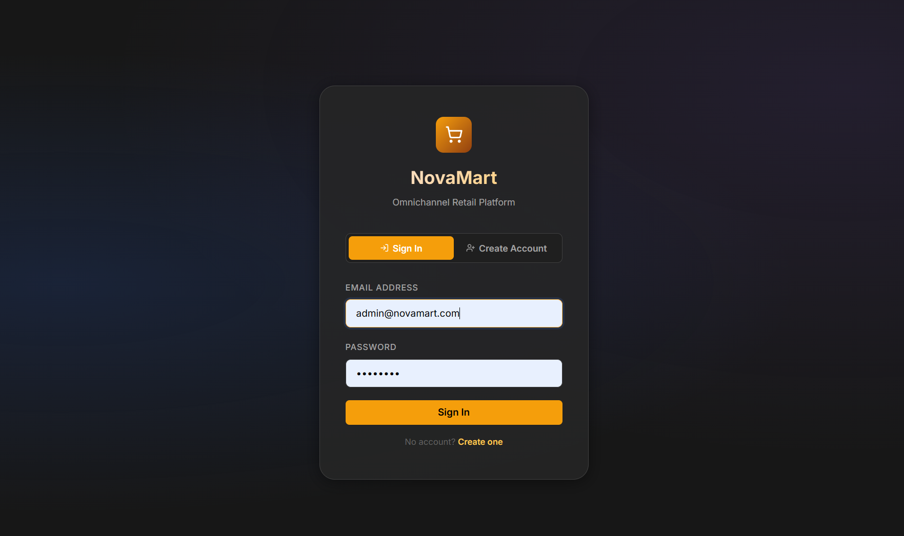
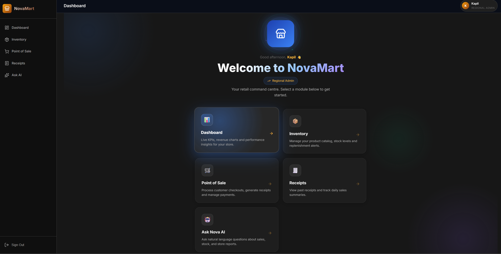
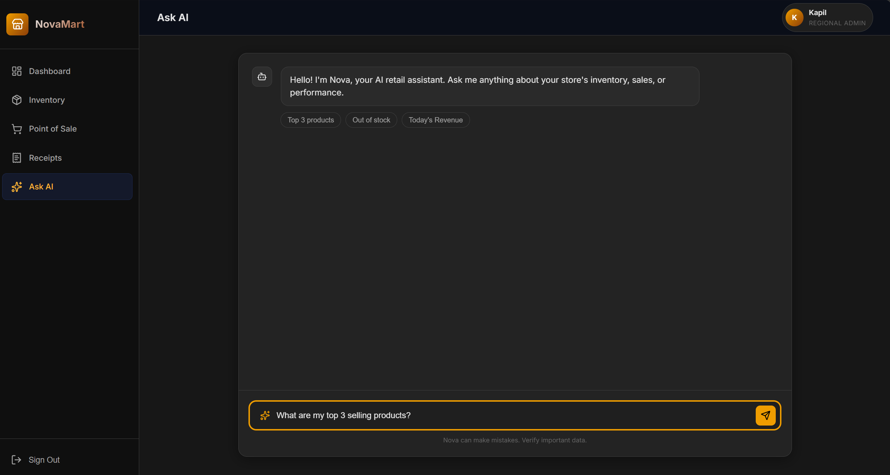
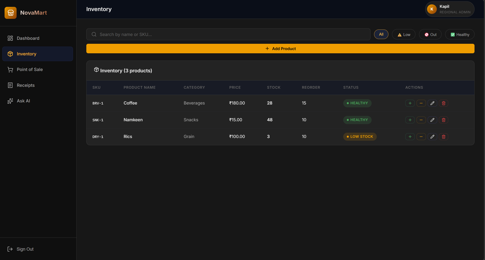

# 🛒 NovaMart

NovaMart is an enterprise-grade, omnichannel retail management ecosystem designed to bridge the gap between physical store operations and digital intelligence. Built on a highly scalable, Docker-orchestrated microservices architecture using FastAPI and Python, it seamlessly integrates a sophisticated, responsive Point of Sale (POS) frontend with robust, real-time global inventory tracking.

The platform's standout feature is **Nova**, an embedded agentic AI assistant powered by **Google Gemini 2.5 Flash**. This allows administrators and store managers to query live PostgreSQL business metrics through natural language, enabling them to generate complex SQL reports and gain actionable insights without any technical database knowledge. With its focus on security, multi-region scalability, and a modern "Amber Minimal" design, NovaMart empowers businesses to manage their inventory and sales with unprecedented efficiency and clarity.

---

## ✨ Project Showcase (Screenshots)

| Login & Authentication | Dashboard |
| :---: | :---: |
|  |  |

| AI Assistant ("Nova") | Inventory Management |
| :---: | :---: |
|  |  |

---

## 🚀 Key Features

- **⚡ Modern POS Billing**: Lightning-fast checkout with real-time stock deductions and digital receipt generation.
- **🤖 Agentic AI Assistant**: "Ask Nova" translates natural language into secure SQL queries via **Gemini 2.5 Flash**.
- **🌍 Multi-Region Support**: Scalable architecture seeded with 20 stores across India and Southeast Asia.
- **🔒 Secure RBAC**: Fine-grained permissions for Regional Admins, Store Managers, and Sales Staff.
- **📊 Live BI Analytics**: Beautiful charts and cards powered by `recharts` for instant performance monitoring.
- **🐳 Dockerized Microservices**: Fully containerized setup for effortless deployment and environment parity.

---

## 🛠️ Tech Stack

- **Frontend**: React 19, Vite, Tailwind-inspired CSS (Amber Minimal), Lucide Icons.
- **Backend**: Python 3.11, FastAPI, Pydantic, Uvicorn.
- **Database**: PostgreSQL 15 via `pg8000`.
- **AI**: Google Generative AI (Gemini 2.5 Flash).
- **DevOps**: Docker, Docker Compose, Nginx.

---

## 🏁 Getting Started

### Prerequisites
- [Docker Desktop](https://www.docker.com/products/docker-desktop/) installed.
- A **Gemini API Key** from [Google AI Studio](https://aistudio.google.com/).

### Installation
1. **Clone the Repository**
   ```bash
   git clone https://github.com/your-username/novamart.git
   cd novamart
   ```

2. **Configure Environment**
   Create a `.env` file in the root directory:
   ```env
   GEMINI_API_KEY=your_actual_key_here
   ```

3. **Launch with Docker**
   ```bash
   docker compose up --build -d
   ```

4. **Access the App**
   Open your browser and navigate to `http://localhost`.

---
*Developed for the Centific Premier Hackathon 2.0. Built with ❤️ by Kapil Gangwar.*
